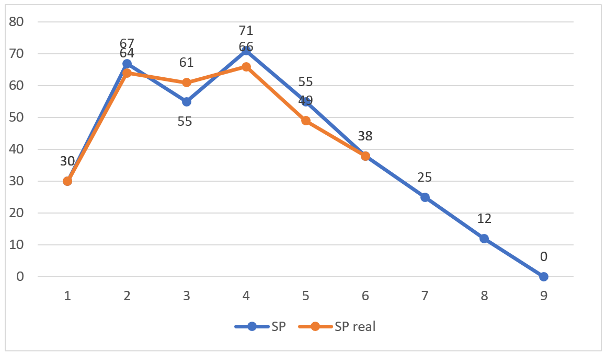

### Tecnologías
Java, Travis, Hibernate, Maven, Cucumber

### Integrantes

Nro | Nombre | Legajo | Mail
----|--------|--------|------
1   |Nahuel Pereyra        |29585        |nahuelmpereyra@gmail.com
2   |Lucas Piergiacomi        |31986        |lg.piergiacomi@gmail.com
3   |Esteban Matas        |28466        |estebanmatas13@gmail.com
4   |Ramiro Belluardo        |29625        |ramirobelluardo1993@gmail.com

### VSM

[Ir a VSM](https://realtimeboard.com/app/board/o9J_kzFlnH0=/)

### BurnDown Chart

### Sprints

#### Sprint 30/05/2018
- Backlog priorizado.
- Ambiente de tecnologia listo.
- Retroespectiva.
- Carpetas por Sprint (Describir alcance del sprint).
- Organizacion de documentos.
- Users Storys del Sprint 1 estimadas.

#### Sprint 06/06/2018
- Burndown Chart
- VSM completo (sumar los user stories faltantes)
- CI completo (con DB).
- Cargar los grupos grupos y mostrarlos. 

#### Sprint 13/06/2018
- Burndown Chart
- Cargar los grupos y mostrarlos. 

#### Sprint 20/06/2018
- Admin elijo cabeza de serie.
- Carga de resutados de partidos.
 

#### Sprint 27/06/2018
- Como admin eliminar equipo
- Al eliminar equipo que se eliminen sus partidos
- No puede haber dos equipos con mismo nombre
- No puede haber mas de 4 equipos en un grupo
- Como admin crear un partido
- Como usuario ver tabla de posiciones por grupo
 
 
 #### Sprint 04/07/2018
- Como usuario quiero que los primeros dos equipos de cada grupo figuren en 8vos
- Como usuario quiero elegir ganador en fase de 8vos en adelante.