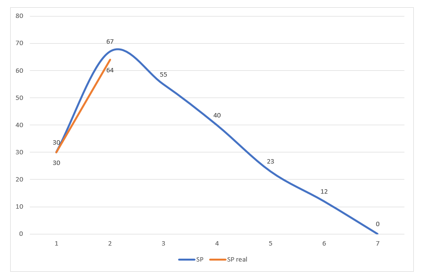

### Tecnologías
Java, Travis, Hibernate, Maven, Cucumber

### Integrantes

Nro | Nombre | Legajo | Mail
----|--------|--------|------
1   |Nahuel Pereyra        |29585        |nahuelmpereyra@gmail.com
2   |Lucas Piergiacomi        |31986        |lg.piergiacomi@gmail.com
3   |Esteban Matas        |28466        |estebanmatas13@gmail.com
4   |Ramiro Belluardo        |29625        |ramirobelluardo1993@gmail.com

### VSM

[Ir a VSM](https://realtimeboard.com/app/board/o9J_kz8U6ZE=/)

### BurnDown Chart

### Sprints

#### Sprint 30/05/2018
- Backlog priorizado.
- Ambiente de tecnologia listo.
- Retroespectiva.
- Carpetas por Sprint (Describir alcance del sprint).
- Organizacion de documentos.
- Users Storys del Sprint 1 estimadas.

#### Sprint 06/06/2018
- Burndown Chart
- VSM completo (sumar los user stories faltantes)
- CI completo (con DB).
- Cargar los grupos grupos y mostrarlos. 
